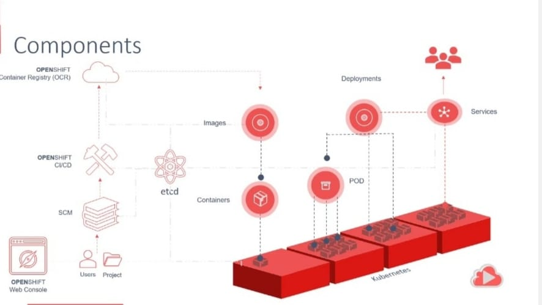

# OpenShift Handbook
***Begineners guide to get started with Red Hat OpenShift.***

  

**Prerequiste:**

To get into OpenShift, you must have a great knowledge of below topics:

1. Docker Containers and Compose
2. Kubernetes 
3. Helm Charts [Optional]

### OpenShift Architecture: 

  

